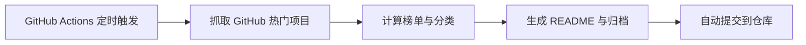

<div align="center">


# 白鹿 GitHub 每日开源趋势榜

每日自动追踪 GitHub 上增长最快、最值得关注的开源项目。  
聚焦 **AI / LLM / Agent / 开发者工具 / 量化交易 / 加密货币 / 法律科技**。

[](https://github.com/bailui/bailu-github-daily-rank/actions/workflows/daily.yml)


</div>

---

## 今日看点

> 本仓库由 GitHub Actions 每日自动更新，用于持续发现值得研究、学习、收藏和二次开发的开源项目。

- **AI 工具榜**：LLM、Agent、RAG、AI 应用、AI 编程工具
- **开发效率榜**：CLI、自动化、低代码、数据库、前端框架
- **量化与加密榜**：交易机器人、行情分析、策略回测、Web3 工具
- **法律科技榜**：合同、文书、合规、知识库、自动化办公
- **每日归档**：自动保存每日榜单，形成长期趋势数据库

---

## 今日趋势榜

<!-- DAILY_RANK_START -->

| 排名 | 项目 | 简介 | 语言 | Stars | Forks | 更新时间 |
|---:|---|---|---|---:|---:|---|
| 1 | `codecrafters-io/build-your-own-x` | Master programming by recreating your favorite technologies from scratch. | Markdown | 493781 | 46757 | 2026-04-24 |
| 2 | `sindresorhus/awesome` | 😎 Awesome lists about all kinds of interesting topics | None | 458409 | 34437 | 2026-04-24 |
| 3 | `freeCodeCamp/freeCodeCamp` | freeCodeCamp.org's open-source codebase and curriculum. Learn math, programming, and computer science for free. | TypeScript | 443456 | 44367 | 2026-04-24 |
| 4 | `public-apis/public-apis` | A collective list of free APIs | Python | 426108 | 46480 | 2026-04-24 |
| 5 | `EbookFoundation/free-programming-books` | :books: Freely available programming books | Python | 385948 | 66123 | 2026-04-24 |
| 6 | `openclaw/openclaw` | Your own personal AI assistant. Any OS. Any Platform. The lobster way. 🦞  | TypeScript | 363045 | 74209 | 2026-04-24 |
| 7 | `kamranahmedse/developer-roadmap` | Interactive roadmaps, guides and other educational content to help developers grow in their careers. | TypeScript | 353492 | 43965 | 2026-04-24 |
| 8 | `donnemartin/system-design-primer` | Learn how to design large-scale systems. Prep for the system design interview.  Includes Anki flashcards. | Python | 343899 | 55525 | 2026-04-24 |
| 9 | `jwasham/coding-interview-university` | A complete computer science study plan to become a software engineer. | None | 342117 | 82088 | 2026-04-24 |
| 10 | `vinta/awesome-python` | An opinionated list of Python frameworks, libraries, tools, and resources | Python | 294092 | 27765 | 2026-04-24 |

<!-- DAILY_RANK_END -->

---

## 项目数据图

<div align="center">


</div>

---

## 每日归档

<!-- ARCHIVE_START -->

暂无归档。首次自动更新后会生成 `docs/YYYY-MM-DD.md`。

<!-- ARCHIVE_END -->

---

## 自动更新机制

本项目每天北京时间 **08:30** 自动运行：



核心文件：

```text
.github/workflows/daily.yml    每日定时任务
scripts/update_rank.py         榜单生成脚本
assets/banner.svg              首页横幅图
assets/stats.svg               数据统计图
data/history.json              历史数据
archive/                       每日归档
```

---

## 适合谁关注

这个榜单适合：

- 想持续跟踪 AI 开源项目的开发者
- 想寻找项目灵感的独立开发者
- 想研究量化交易、加密货币工具的人
- 想沉淀开源工具导航站、博客内容的人
- 想观察技术趋势、发现早期机会的人

---

## 免责声明

本项目仅用于开源项目观察、学习研究和趋势记录。榜单不构成投资建议、交易建议或法律意见。涉及加密货币、金融交易或第三方工具时，请自行审慎判断风险。

---

<div align="center">

由 **白鹿 io** 持续维护。  
让好项目被看见，让长期主义有记录。

</div>
