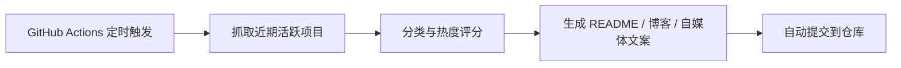

<div align="center">


# 白鹿 GitHub 每日开源趋势榜

这是白鹿 io 自建的每日开源观察栏目，用来记录 GitHub 上近期值得关注的工具、项目和技术趋势。  
重点关注 **AI 工具、效率工具、学习资源、图片视频、投资加密、开发工具**，既方便我自己长期跟踪，也方便有需要的人收藏参考。

[](https://github.com/bailui/bailu-github-daily-rank/actions/workflows/daily.yml)


**每天 08:30 自动更新｜开源观察｜工具收藏｜选题参考｜长期记录**

</div>

---

## 为什么做这个项目

每天都会有很多新的开源项目出现，但真正值得长期关注的项目并不容易筛选。这个仓库想做的事情很简单：

- 记录每天值得看的 GitHub 项目
- 从 AI、效率、学习、内容创作、金融科技等方向筛选实用工具
- 把项目整理成更容易阅读的榜单、文章和自媒体素材
- 为后续博客、导航站、工具合集沉淀数据

这个项目不是单纯给别人看的展示页，而是一个长期使用的内容和工具数据库。

---

## 每天自动生成什么

本仓库每天会自动生成三类内容：

```text
README.md                         今日精选榜单
docs/YYYY-MM-DD.md                博客文章版
content/xiaohongshu/YYYY-MM-DD.md 自媒体文案版
```

---

## 今日趋势榜

<!-- DAILY_RANK_START -->

| 排名 | 项目 | 简介 | 语言 | Stars | Forks | 更新时间 |
|---:|---|---|---|---:|---:|---|
| 1 | `codecrafters-io/build-your-own-x` | Master programming by recreating your favorite technologies from scratch. | Markdown | 493781 | 46757 | 2026-04-24 |
| 2 | `sindresorhus/awesome` | 😎 Awesome lists about all kinds of interesting topics | None | 458409 | 34437 | 2026-04-24 |
| 3 | `freeCodeCamp/freeCodeCamp` | freeCodeCamp.org's open-source codebase and curriculum. Learn math, programming, and computer science for free. | TypeScript | 443456 | 44367 | 2026-04-24 |
| 4 | `public-apis/public-apis` | A collective list of free APIs | Python | 426108 | 46480 | 2026-04-24 |
| 5 | `EbookFoundation/free-programming-books` | :books: Freely available programming books | Python | 385948 | 66123 | 2026-04-24 |
| 6 | `openclaw/openclaw` | Your own personal AI assistant. Any OS. Any Platform. The lobster way. 🦞  | TypeScript | 363045 | 74209 | 2026-04-24 |
| 7 | `kamranahmedse/developer-roadmap` | Interactive roadmaps, guides and other educational content to help developers grow in their careers. | TypeScript | 353492 | 43965 | 2026-04-24 |
| 8 | `donnemartin/system-design-primer` | Learn how to design large-scale systems. Prep for the system design interview.  Includes Anki flashcards. | Python | 343899 | 55525 | 2026-04-24 |
| 9 | `jwasham/coding-interview-university` | A complete computer science study plan to become a software engineer. | None | 342117 | 82088 | 2026-04-24 |
| 10 | `vinta/awesome-python` | An opinionated list of Python frameworks, libraries, tools, and resources | Python | 294092 | 27765 | 2026-04-24 |

<!-- DAILY_RANK_END -->

---

## 项目数据图

<div align="center">


</div>

---

## 内容入口

- 每日博客文章：[`docs/`](docs/)
- 自媒体素材：[`content/xiaohongshu/`](content/xiaohongshu/)
- 主站：`https://www.bailuioai.com/`
- 目标：沉淀 AI 工具、效率工具、开源项目、导航站和内容选题数据库

---

## 自动更新机制

本项目每天北京时间 **08:30** 自动运行：



---

## 免责声明

本项目仅用于开源项目观察、学习研究和工具发现。榜单不构成投资建议、交易建议或法律意见。涉及加密货币、金融交易或第三方工具时，请自行审慎判断风险。

---

<div align="center">

由 **白鹿 io** 持续维护。  
记录开源项目，也记录新的工具机会。

</div>
