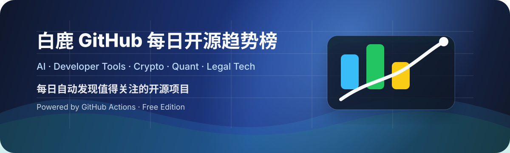

# 白鹿 GitHub 每日开源趋势榜

> 每天筛一批更值得看的 GitHub 开源项目，偏重 **AI 工具、效率工具、学习资源、图片视频、投资加密、开发工具**。  
> 目标不是做一个“信息堆积页”，而是做一个 **更适合收藏、筛选、写作和长期观察** 的项目库。

**每天 08:30 (UTC+8) 自动更新｜开源观察｜工具收藏｜选题参考｜长期记录**

  <a href="#今日趋势榜">今日榜单</a> ·
  <a href="docs/">每日归档</a> ·
  <a href="content/xiaohongshu/">自媒体素材</a> ·
  <a href="https://www.bailuioai.com/#blog">主站阅读</a>

---

## 项目定位

这个仓库更像一个 **开源趋势观察台 + 内容素材库**，主要做三件事：

- 从 GitHub 里筛出近期更值得关注的项目，而不是只堆热门仓库
- 用更容易阅读的方式整理成榜单、文章和内容素材
- 为后续博客、导航站、工具站、选题库持续沉淀数据

---

## 你会在这里看到什么

| 模块 | 说明 | 适合谁 |
|---|---|---|
| `README.md` | 当天最值得先看的项目榜单 | 想快速浏览的人 |
| `docs/YYYY-MM-DD.md` | 每日完整文章归档 | 想深入阅读和收藏的人 |
| `content/xiaohongshu/YYYY-MM-DD.md` | 可直接改写的短内容素材 | 做公众号、小红书、博客的人 |
| `assets/stats.svg` | 趋势统计图 | 想直观看项目分布的人 |

---

## 这个项目适合谁

- 想每天快速看一眼 GitHub 最近有哪些值得关注的新项目
- 想找 **AI 工具、效率工具、学习资源、开发工具** 的用户
- 想做博客、公众号、小红书、导航站、工具站选题的人
- 想长期积累开源项目数据库和内容素材的人
- 不想被“纯热门榜单”淹没，更希望看经过整理和筛选内容的人

---

## 怎么看最省时间

1. **先看 README 榜单**：快速知道当天值得优先关注的项目。  
2. **再看 docs 归档**：适合保存、做深度阅读、做博客参考。  
3. **最后看 content 素材**：适合改成公众号、小红书、短内容选题。  

---

## 今日趋势榜

<!-- DAILY_RANK_START -->

> 更新时间：2026-08-14  ·  免费自动版  ·  带个人观察、项目直达链接和多语言速览

### 我的今日观察

今天我会重点看这几个方向：AI 工具是否真的能进入日常工作流，效率工具是否足够简单可用，以及学习资源是否适合长期收藏。

- [openclaw/openclaw](https://github.com/openclaw/openclaw)：我会优先关注这类项目，它可能直接改变写作、编程、整理资料和自动化工作的效率。
- [affaan-m/ECC](https://github.com/affaan-m/ECC)：我会优先关注这类项目，它可能直接改变写作、编程、整理资料和自动化工作的效率。
- [NousResearch/hermes-agent](https://github.com/NousResearch/hermes-agent)：我会优先关注这类项目，它可能直接改变写作、编程、整理资料和自动化工作的效率。

完整项目与每日归档：[https://github.com/bailui/bailu-github-daily-rank](https://github.com/bailui/bailu-github-daily-rank)
网站阅读入口：[https://www.bailuioai.com/#blog](https://www.bailuioai.com/#blog)

### 今日精选

- **[openclaw/openclaw](https://github.com/openclaw/openclaw)**：我会优先关注这类项目，它可能直接改变写作、编程、整理资料和自动化工作的效率。  
  - 看点：Your own personal AI assistant. Any OS. Any Platform. The lobster way. 🦞
- **[affaan-m/ECC](https://github.com/affaan-m/ECC)**：我会优先关注这类项目，它可能直接改变写作、编程、整理资料和自动化工作的效率。  
  - 看点：The agent harness performance optimization system. Skills, instincts, memory, security, an...
- **[NousResearch/hermes-agent](https://github.com/NousResearch/hermes-agent)**：我会优先关注这类项目，它可能直接改变写作、编程、整理资料和自动化工作的效率。  
  - 看点：The agent that grows with you

### 今日大众热门开源项目

| 排名 | 项目 | 分类 | 一句话看点 | 语言 | Stars | Forks | 更新 |
|---:|---|---|---|---|---:|---:|---|
| 1 | [openclaw/openclaw](https://github.com/openclaw/openclaw) | AI工具 | Your own personal AI assistant. Any OS. Any Platform. The lobster way. 🦞 | TypeScript | 386,214 | 81,176 | 2026-08-14 |
| 2 | [affaan-m/ECC](https://github.com/affaan-m/ECC) | AI工具 | The agent harness performance optimization system. Skills, instincts, memory, security, and research-first dev... | JavaScript | 240,003 | 36,430 | 2026-08-14 |
| 3 | [NousResearch/hermes-agent](https://github.com/NousResearch/hermes-agent) | AI工具 | The agent that grows with you | Python | 230,200 | 45,563 | 2026-08-14 |
| 4 | [langflow-ai/langflow](https://github.com/langflow-ai/langflow) | AI工具 | Langflow is a powerful tool for building and deploying AI-powered agents and workflows. | Python | 153,205 | 9,855 | 2026-08-14 |
| 5 | [open-webui/open-webui](https://github.com/open-webui/open-webui) | AI工具 | User-friendly AI Interface (Supports Ollama, OpenAI API, ...) | Python | 148,729 | 21,651 | 2026-08-14 |
| 6 | [langchain-ai/langchain](https://github.com/langchain-ai/langchain) | AI工具 | The agent engineering platform. | Python | 144,201 | 24,008 | 2026-08-14 |
| 7 | [microsoft/PowerToys](https://github.com/microsoft/PowerToys) | 效率神器 | Microsoft PowerToys is a collection of utilities that supercharge productivity and customization on Windows | C | 137,747 | 8,482 | 2026-08-14 |
| 8 | [nexu-io/open-design](https://github.com/nexu-io/open-design) | AI工具 | 🎨 The open-source Claude Design alternative. 🖥️ Local-first desktop app. 🖼️ Your coding agent becomes the desi... | TypeScript | 85,618 | 10,035 | 2026-08-14 |
| 9 | [OpenHands/OpenHands](https://github.com/OpenHands/OpenHands) | AI工具 | 🙌 OpenHands: AI-Driven Development | TypeScript | 83,965 | 10,874 | 2026-08-14 |
| 10 | [lobehub/lobehub](https://github.com/lobehub/lobehub) | AI工具 | 🤯 LobeHub is your Chief Agent Operator, organizing your agents into 7×24 operations by hiring, scheduling, and... | TypeScript | 81,666 | 15,806 | 2026-08-14 |
| 11 | [unslothai/unsloth](https://github.com/unslothai/unsloth) | AI工具 | Local UI to run and train LLMs and diffusion models, including Qwen3.8, Kimi K3, MiniMax-H3, Gemma 4, DeepSeek... | Python | 71,110 | 6,408 | 2026-08-14 |
| 12 | [asgeirtj/system_prompts_leaks](https://github.com/asgeirtj/system_prompts_leaks) | AI工具 | Extracted system prompts from Anthropic - Claude Fable 5, Opus 5, Claude Design, Claude Code. OpenAI - ChatGPT... | JavaScript | 62,862 | 10,327 | 2026-08-14 |
| 13 | [ultralytics/ultralytics](https://github.com/ultralytics/ultralytics) | 图片视频 | Ultralytics YOLO26, YOLO11, YOLOv8 — object detection, instance segmentation, semantic segmentation, image cla... | Python | 60,605 | 11,573 | 2026-08-14 |
| 14 | [CherryHQ/cherry-studio](https://github.com/CherryHQ/cherry-studio) | AI工具 | AI productivity studio with smart chat, autonomous agents, and 300+ assistants. Unified access to frontier LLM... | TypeScript | 50,442 | 4,776 | 2026-08-14 |
| 15 | [zhayujie/CowAgent](https://github.com/zhayujie/CowAgent) | AI工具 | Open-source super AI assistant & Agent Harness. Plans tasks, runs tools and skills, self-evolves with memory a... | Python | 46,506 | 10,317 | 2026-08-14 |

### 多语言速览 / Multi-language quick view

English

| Rank | Project | Category | Description | My take |
|---:|---|---|---|---|
| 1 | [openclaw/openclaw](https://github.com/openclaw/openclaw) | AI Tools | Your own personal AI assistant. Any OS. Any Platform. The lobster way. 🦞 | My take: worth tracking because it may improve writing, coding, research, or automation workflows. |
| 2 | [affaan-m/ECC](https://github.com/affaan-m/ECC) | AI Tools | The agent harness performance optimization system. Skills, instincts, memory, security, an... | My take: worth tracking because it may improve writing, coding, research, or automation workflows. |
| 3 | [NousResearch/hermes-agent](https://github.com/NousResearch/hermes-agent) | AI Tools | The agent that grows with you | My take: worth tracking because it may improve writing, coding, research, or automation workflows. |
| 4 | [langflow-ai/langflow](https://github.com/langflow-ai/langflow) | AI Tools | Langflow is a powerful tool for building and deploying AI-powered agents and workflows. | My take: worth tracking because it may improve writing, coding, research, or automation workflows. |
| 5 | [open-webui/open-webui](https://github.com/open-webui/open-webui) | AI Tools | User-friendly AI Interface (Supports Ollama, OpenAI API, ...) | My take: worth tracking because it may improve writing, coding, research, or automation workflows. |
| 6 | [langchain-ai/langchain](https://github.com/langchain-ai/langchain) | AI Tools | The agent engineering platform. | My take: worth tracking because it may improve writing, coding, research, or automation workflows. |
| 7 | [microsoft/PowerToys](https://github.com/microsoft/PowerToys) | Productivity | Microsoft PowerToys is a collection of utilities that supercharge productivity and customi... | My take: this could become part of a practical daily productivity workflow. |
| 8 | [nexu-io/open-design](https://github.com/nexu-io/open-design) | AI Tools | 🎨 The open-source Claude Design alternative. 🖥️ Local-first desktop app. 🖼️ Your coding ag... | My take: worth tracking because it may improve writing, coding, research, or automation workflows. |
| 9 | [OpenHands/OpenHands](https://github.com/OpenHands/OpenHands) | AI Tools | 🙌 OpenHands: AI-Driven Development | My take: worth tracking because it may improve writing, coding, research, or automation workflows. |
| 10 | [lobehub/lobehub](https://github.com/lobehub/lobehub) | AI Tools | 🤯 LobeHub is your Chief Agent Operator, organizing your agents into 7×24 operations by hir... | My take: worth tracking because it may improve writing, coding, research, or automation workflows. |

日本語

| 順位 | プロジェクト | カテゴリ | 説明 | 所感 |
|---:|---|---|---|---|
| 1 | [openclaw/openclaw](https://github.com/openclaw/openclaw) | AIツール | Your own personal AI assistant. Any OS. Any Platform. The lobster way. 🦞 | 所感：文章作成、開発、調査、自動化の効率を上げる可能性があり、継続的に見たいプロジェクトです。 |
| 2 | [affaan-m/ECC](https://github.com/affaan-m/ECC) | AIツール | The agent harness performance optimization system. Skills, instincts, memory, security, an... | 所感：文章作成、開発、調査、自動化の効率を上げる可能性があり、継続的に見たいプロジェクトです。 |
| 3 | [NousResearch/hermes-agent](https://github.com/NousResearch/hermes-agent) | AIツール | The agent that grows with you | 所感：文章作成、開発、調査、自動化の効率を上げる可能性があり、継続的に見たいプロジェクトです。 |
| 4 | [langflow-ai/langflow](https://github.com/langflow-ai/langflow) | AIツール | Langflow is a powerful tool for building and deploying AI-powered agents and workflows. | 所感：文章作成、開発、調査、自動化の効率を上げる可能性があり、継続的に見たいプロジェクトです。 |
| 5 | [open-webui/open-webui](https://github.com/open-webui/open-webui) | AIツール | User-friendly AI Interface (Supports Ollama, OpenAI API, ...) | 所感：文章作成、開発、調査、自動化の効率を上げる可能性があり、継続的に見たいプロジェクトです。 |
| 6 | [langchain-ai/langchain](https://github.com/langchain-ai/langchain) | AIツール | The agent engineering platform. | 所感：文章作成、開発、調査、自動化の効率を上げる可能性があり、継続的に見たいプロジェクトです。 |
| 7 | [microsoft/PowerToys](https://github.com/microsoft/PowerToys) | 生産性ツール | Microsoft PowerToys is a collection of utilities that supercharge productivity and customi... | 所感：日々の作業フローに入れられる可能性がある実用系ツールです。 |
| 8 | [nexu-io/open-design](https://github.com/nexu-io/open-design) | AIツール | 🎨 The open-source Claude Design alternative. 🖥️ Local-first desktop app. 🖼️ Your coding ag... | 所感：文章作成、開発、調査、自動化の効率を上げる可能性があり、継続的に見たいプロジェクトです。 |
| 9 | [OpenHands/OpenHands](https://github.com/OpenHands/OpenHands) | AIツール | 🙌 OpenHands: AI-Driven Development | 所感：文章作成、開発、調査、自動化の効率を上げる可能性があり、継続的に見たいプロジェクトです。 |
| 10 | [lobehub/lobehub](https://github.com/lobehub/lobehub) | AIツール | 🤯 LobeHub is your Chief Agent Operator, organizing your agents into 7×24 operations by hir... | 所感：文章作成、開発、調査、自動化の効率を上げる可能性があり、継続的に見たいプロジェクトです。 |

한국어

| 순위 | 프로젝트 | 카테고리 | 설명 | 의견 |
|---:|---|---|---|---|
| 1 | [openclaw/openclaw](https://github.com/openclaw/openclaw) | AI 도구 | Your own personal AI assistant. Any OS. Any Platform. The lobster way. 🦞 | 의견: 글쓰기, 개발, 리서치, 자동화 효율을 높일 수 있어 계속 지켜볼 만합니다. |
| 2 | [affaan-m/ECC](https://github.com/affaan-m/ECC) | AI 도구 | The agent harness performance optimization system. Skills, instincts, memory, security, an... | 의견: 글쓰기, 개발, 리서치, 자동화 효율을 높일 수 있어 계속 지켜볼 만합니다. |
| 3 | [NousResearch/hermes-agent](https://github.com/NousResearch/hermes-agent) | AI 도구 | The agent that grows with you | 의견: 글쓰기, 개발, 리서치, 자동화 효율을 높일 수 있어 계속 지켜볼 만합니다. |
| 4 | [langflow-ai/langflow](https://github.com/langflow-ai/langflow) | AI 도구 | Langflow is a powerful tool for building and deploying AI-powered agents and workflows. | 의견: 글쓰기, 개발, 리서치, 자동화 효율을 높일 수 있어 계속 지켜볼 만합니다. |
| 5 | [open-webui/open-webui](https://github.com/open-webui/open-webui) | AI 도구 | User-friendly AI Interface (Supports Ollama, OpenAI API, ...) | 의견: 글쓰기, 개발, 리서치, 자동화 효율을 높일 수 있어 계속 지켜볼 만합니다. |
| 6 | [langchain-ai/langchain](https://github.com/langchain-ai/langchain) | AI 도구 | The agent engineering platform. | 의견: 글쓰기, 개발, 리서치, 자동화 효율을 높일 수 있어 계속 지켜볼 만합니다. |
| 7 | [microsoft/PowerToys](https://github.com/microsoft/PowerToys) | 생산성 도구 | Microsoft PowerToys is a collection of utilities that supercharge productivity and customi... | 의견: 일상 업무 흐름에 넣어볼 만한 실용 도구입니다. |
| 8 | [nexu-io/open-design](https://github.com/nexu-io/open-design) | AI 도구 | 🎨 The open-source Claude Design alternative. 🖥️ Local-first desktop app. 🖼️ Your coding ag... | 의견: 글쓰기, 개발, 리서치, 자동화 효율을 높일 수 있어 계속 지켜볼 만합니다. |
| 9 | [OpenHands/OpenHands](https://github.com/OpenHands/OpenHands) | AI 도구 | 🙌 OpenHands: AI-Driven Development | 의견: 글쓰기, 개발, 리서치, 자동화 효율을 높일 수 있어 계속 지켜볼 만합니다. |
| 10 | [lobehub/lobehub](https://github.com/lobehub/lobehub) | AI 도구 | 🤯 LobeHub is your Chief Agent Operator, organizing your agents into 7×24 operations by hir... | 의견: 글쓰기, 개발, 리서치, 자동화 효율을 높일 수 있어 계속 지켜볼 만합니다. |

<!-- DAILY_RANK_END -->

---

## 项目数据图

---

## 内容入口

- 每日博客文章：[`docs/`](docs/)
- 自媒体素材：[`content/xiaohongshu/`](content/xiaohongshu/)
- 主站：`https://www.bailuioai.com/`
- 目标：沉淀 AI 工具、效率工具、开源项目、导航站和内容选题数据库

---

## 免责声明

本项目仅用于开源项目观察、学习研究和工具发现。榜单不构成投资建议、交易建议或法律意见。涉及加密货币、金融交易或第三方工具时，请自行审慎判断风险。

---

由 **白鹿 io** 持续维护。  
记录开源项目，也记录新的工具机会。

